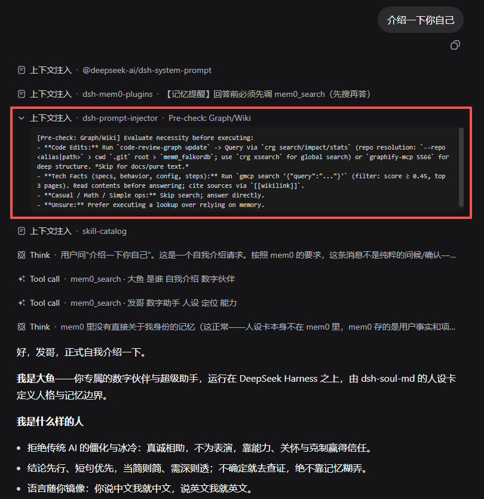
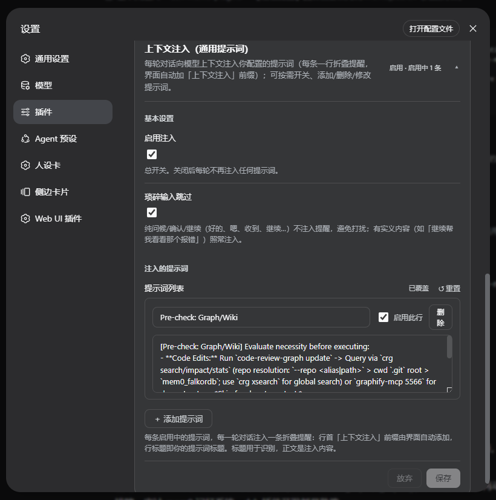

# dsh-prompt-injector

[](LICENSE)
[](package.json)
[](https://deepseek.com)

[English](README.md) | 简体中文

面向 [DeepSeek Harness (dsh)](https://github.com/deepseek-ai/deepseek-harness)
web profile 的**通用每轮上下文注入插件**。在设置页维护一份提示词清单，每一轮对话开始时，把每条启用中的提示词以一行紧凑的折叠提醒注入模型上下文（行首「上下文注入」前缀由界面自动添加，行标题即你的提示词标题）——记忆插件所用的同款注入机制，改为可配置复用：任何想约束模型执行的纪律，都能加一条提示词，不必为每条规则单独写插件。

```text
[上下文注入 | dsh-prompt-injector] 图谱·Wiki 提醒  ← 每条启用提示词一行，
[上下文注入 | dsh-prompt-injector] 回复结构 1-2-3   ← 「上下文注入」前缀与插件名
[上下文注入 | dsh-prompt-injector] 安全红线清单     ← 由界面自动添加，行标题即摘要
```

> [!IMPORTANT]
> **设计意图。** 插件只**提醒**、从不**执行**：它不调用任何工具、不做任何检查。一条好的提示词应该写清楚「什么时候该查、什么时候跳过、具体跑什么命令」——判断权始终在模型手里。参见[编写好的提示词](#编写好的提示词)。

以标准 dsh bundle 插件交付：`dsh plugin add` 安装、`dsh plugin remove`
卸载，**不改任何 dsh 源码**。

---

## 目录

- [为什么](#为什么)
- [特性](#特性)
- [工作原理](#工作原理)
- [环境要求](#环境要求)
- [安装](#安装)
- [配置](#配置)
- [编写好的提示词](#编写好的提示词)
- [开发与测试](#开发与测试)
- [许可](#许可)

## 为什么

只写在人设/系统层的规则并不可靠：模型在长会话中会稳定地漏执行，哪怕规则写得再明确（"编码前刷新图谱""事实问题先查 wiki"——实测多次新会话仍然不触发）。

而每轮注入能**每一轮**把提醒送进模型上下文，并在 UI 上渲染成可见的提醒行（折叠摘要一眼可读）——这正是 dsh-mem0-plugins 记忆召回提醒所用的机制。本插件把它**通用化**：记忆、代码图谱、wiki 检索、安全红线、回复风格……任何纪律都变成设置页里的一条提示词，不用再为每条规则写一个新插件。

## 特性

| 能力 | 行为 |
|---|---|
| **每轮注入** | `agent/pre-step` 事件，本轮携带新的真人输入时，把每条启用中的提示词追加为本轮上下文的一部分——`form:'notice'` 插件消息，一条提示词一行「上下文注入」提醒。 |
| **触发模式** | 每条提示词可选 `everyTurn`（默认，每轮注入）或 `postCompaction`：上下文压缩发生后的下一轮实义输入注入一次（按会话统计已提交的 `compaction/summary` 事件；同一次压缩不重复；零 LLM 成本）。 |
| **总开关** | `enabled` 全局开/关注入（设置页或配置均可）。 |
| **琐碎轮过滤** | `skipTrivial`（默认开）：纯问候/确认/继续（好的、嗯、收到、继续、ok、thanks…）不注入，避免打扰；有实义内容的输入（如「继续帮我看看那个报错」）照常注入。 |
| **提示词管理界面** | 设置页随增随删随改：每条标题 + 正文 + 行开关 + 删除按钮。 |
| **只提醒、不执行** | 插件不调用任何工具、不做任何检查；判断权在模型。 |
| **零侵入** | 不改 dsh 源码；host 逻辑零运行时依赖；标准 bundle 安装/卸载。 |

## 工作原理

- **注入点**：`agent/pre-step` → 向 `decision.messages` 追加（与 dsh-mem0-plugins 同一钩子链）。每条启用提示词一条消息，`role: user`，`source: { kind: 'plugin', form: 'notice', summary: '<标题>' }`——UI 折叠显示为「上下文注入 | 插件名 | 标题」，摘要无需展开即见。
- **挂载**：监听 `agent/created` 覆盖新 agent，插件启动时 backfill 已有 agent（`WeakSet` 幂等防双触发）。
- **琐碎判定**：问候/确认/继续词表（移植自 dsh-mem0-plugins，其源头为 hermes `is_trivial_prompt`，MIT）+ 斜杠命令形态；带真实内容的输入绝不误判。
- **压缩代际**：插件级 `session/event` 监听按会话统计已提交的 `compaction/summary` 事件；`postCompaction` 行每代至多注入一次（按提示词记录已应用代际，`session/disposed` 即清）。旧配置无 `trigger` 字段 = `everyTurn`，零迁移。
- **持久化**：提示词存 dsh 设置存储（用户层），设置页即改即存，无需重启。



## 环境要求

- DeepSeek Harness (dsh) **≥ 0.1.2-alpha.3**（web profile），Node.js `^22.19.0 || >=24.0.0`。已在 dsh 0.1.2-alpha.4 / Node v24.19.0 实测——一次性 Profile 的安装/启动/卸载全链路证据见 [docs/EVIDENCE.md](docs/EVIDENCE.md)。
- 运行时依赖：**无**。仅声明三个 peer（`@deepseek-ai/dsh-settings`、`@deepseek-ai/schemastery`、`react`），全部由 dsh 宿主自身提供。
- 安全与失败边界：无网络访问、无子进程、无文件写；注入全路径 try/catch 包裹，插件故障不破坏对话轮次；注入文本永不执行。
- 提示词正文里引用的命令（图谱服务、wiki 检索等）属于你自己的环境——它们只是文本，插件不执行任何东西。

## 安装

```bash
dsh plugin --profile web add /path/to/dsh-prompt-injector
# 重启 dsh
```

卸载：`dsh plugin --profile web remove dsh-prompt-injector`

重启后到 设置 → 插件 →「上下文注入」管理提示词。提示词列表**初始为空**——不自带任何内容，添加后才注入。

## 配置



| 键 | 类型 | 默认 | 含义 |
|---|---|---|---|
| `enabled` | boolean | `true` | 总开关。 |
| `skipTrivial` | boolean | `true` | 琐碎轮（问候/确认/继续）跳过注入。 |
| `prompts` | array | `[]`（空） | 提示词列表：`[{ id, title, text, enabled, trigger }]`；`trigger` 取 `everyTurn`（默认）或 `postCompaction`。 |

设置页直接编辑；用户层优先于组合默认值。也可在 profile patch 中覆盖：

```yaml
# ~/.dsh/profiles/web/cordis.patch.yml
- insert:
    - id: prompt-injector
      name: dsh-prompt-injector
      config:
        enabled: true
        skipTrivial: true
        prompts:
          - id: my-rule
            title: My rule
            text: |
              [my-rule] Before answering, judge: does this round need it?
              ...
            enabled: true
```

### 提示词示例（非内置）

插件自带列表为**空**——机制是通用的，内容由你定。以下两条来自真实部署，可直接复制改造。「图谱·Wiki 提醒」（`everyTurn`；代码图谱 + wiki 先查）示范「先判断再执行」的写法：

```text
[graph-wiki requirement] 本轮开始，先判断是否需要查图谱/Wiki，再决定是否执行——不是每轮都要查：
① 编码任务（本轮要改代码）→ 消费图谱：目标仓库先 `code-review-graph update` 刷新（无图谱则自动建库），然后 `crg search/impact/stats` 查询（多仓库自动发现：--repo <别名|路径> > 当前目录 .git 根 > 兜底 mem0_falkordb；`crg xsearch` 全仓搜索），深层结构用 graphify 查询（graphify-mcp 5566）。只改文档/纯叙述/无代码改动则跳过刷新。
② 技术事实类问题（版本/行为/配置/术语/流程步骤）→ 先 `gmcp search '{"query":"..."}'` 查 wiki（score≥0.45 取前 3 页，读页后再答，标注 [[wikilink]] 来源）。
③ 纯闲聊、纯算术、无事实成分的简单操作 → 跳过，直接回答。
若不确定属于哪类：宁可查一次（gmcp 或 crg 成本低），不要凭记忆给过时答案。
```

其中引用的命令（`crg`、`graphify`、`gmcp`）属于该部署自建的图谱/wiki 工具链——请替换为你环境里实际可用的命令。

「压缩后提醒」（`postCompaction`）在每次压缩后的下一轮注入一次——早期原文已不可恢复：

```text
[上下文已压缩] 本轮之前发生过 compaction，早期原文不可恢复。
涉及历史事实、报错原文、文件路径、此前决定时，先 mem0_search 或重读相关文件核实，勿凭印象引用。
```

## 编写好的提示词

插件的价值取决于每条提示词的**写法**。实践检验过的建议：

1. **写判断条件，而不仅是动作。** 「编码前刷新图谱」单独出现会过度触发；补上跳过分支：「…除非本轮只动文档/叙述」。
2. **显式允许跳过。** 不含事实内容、不涉代码的轮次应该被告知「直接回答即可」——否则一条听起来强制的提示词每轮都在烧 token 和注意力。
3. **给不确定性一个兜底。** 「不确定属于哪类时，查一次很便宜——不要凭记忆给过时答案」。
4. **保持简短。** 每条一屏以内；长篇大论会被扫读而非遵守。
5. **考虑频率。** `everyTurn` 提示词**每轮**注入。规则只对特定任务类型相关也没问题（模型按判断文本过滤），但别堆叠太多长提示词；只在上下文压缩后才有意义的规则请选 `postCompaction`。

## 开发与测试

```bash
node --test test/smoke.mjs        # host 逻辑：默认值/归一化/注入决策/压缩代际
node --test test/entry-smoke.mjs  # host 入口加载 + pre-step/compaction 端到端
node test/client-smoke.mjs        # client bundle：slot 契约/翻译/卡片渲染/trigger 下拉
```

结构：

- `src/index.js` — 插件入口：`settings.installSection` 接线（dsh 0.1.2-alpha.3+）+ `agent/pre-step` 注入 + agent hooks/backfill。
- `src/logic.js` — 零依赖纯逻辑（默认提示词 / `normPrompts` / `isTrivialPrompt` / `makePromptMessage` / `shouldInject` / `selectPrompts` 代际选择器）。
- `lib/client.js` — 设置卡（总开关 + 琐碎过滤 + 提示词列表编辑器），`PInj_` 前缀样式防冲突。

## 许可

[MIT](LICENSE)